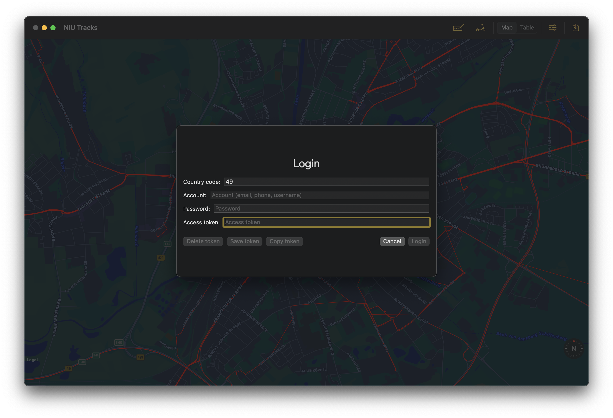
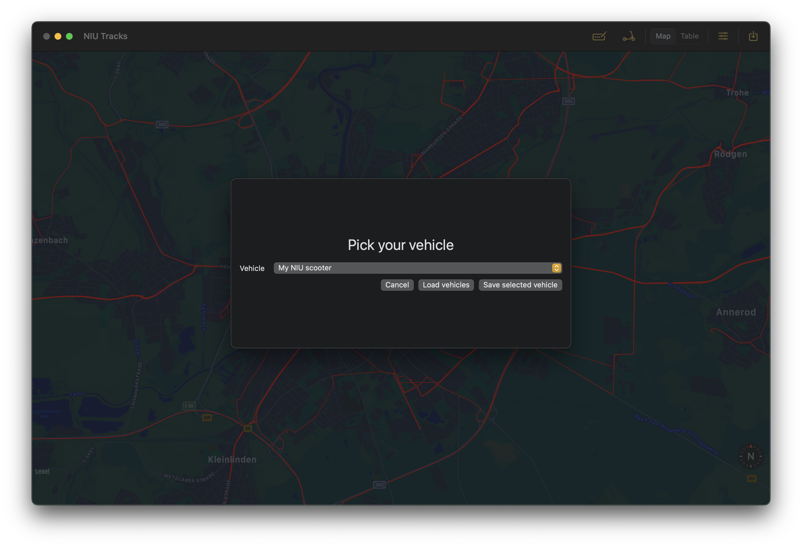
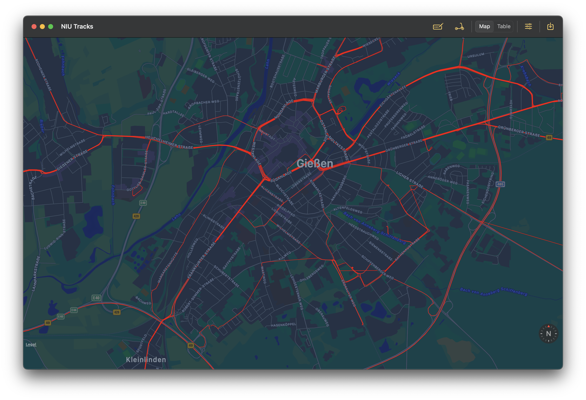
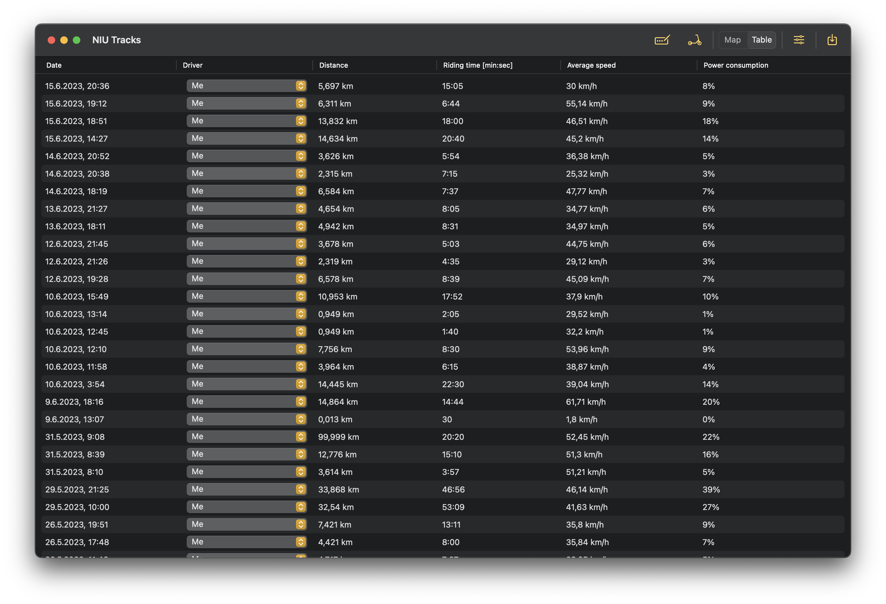
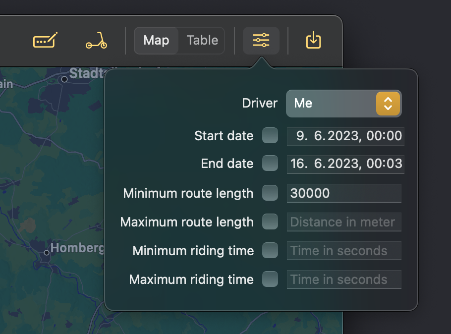

#  NIU-Tracks

*NIU-Tracks* lets you download all the tracks recorded by your *Niu-Scooter*. For information about *Niu-Scooter*, check their [website](https://niu.com).

The app provides a login form to access your account. You need to provide your country code and whatever login credentials you chose. When logged in, an access token is created and stored. This is needed to access the data from your scooter. You can open the login form any time with the login button in the toolbar or via the login menu item.
Here is a picture of the login form:



If you registered with your phone number +491711234567, the login should look like this 
```
Coutry code: 49
Account: 1711234567
Password: mySuperSecretPassword
```
Click *Login* to login. This will automatically create an access token and fill the *Access token* field. The window should also automatically close.


Once you have your token, you need to pick your vehicle. You can open the vehicle picker any time with the scooter icon in the toolbar or via the vehicle picker menu item.
Start with loading the vehicle list and then pick your vehicle. Save your selection with the *Save selected vehicle* button.
Here is a picture of the vehicle picker:



The download button on the top right will then start the download of all available tracks for the selected vehicle.
Tracks are downloaded in batches of 10 tracks.
The first download will download all available tracks and store the download date. The next download will then only download tracks newer than the last saved download date.
All tracks are locally stored in a database.
If you need to re-download all tracks, you can do so via the menu item.
This is sometimes needed when the API (for some reason) does not provide all tracks.

Once the tracks are downloaded, you can see all of them on a map or list:





The list view also allows you to pick a driver.
Currently you can chose between *Me* and *Someone else*. This can be helpful if the scooter is shared and you just want an overview of your own rides.

The toolbar provides a filter for filtering the downloaded tracks. The filter will affect the map and list view. Only filter options which are checked will be evaluated.




## Bugs, errors and new features

If you find a bug, strange app behaviour or you have an idea for a new feature, feel free to open as GitHub issue or contact me otherwise.
Pull requests are also welcome.


## NiuAPI

This app uses the unofficial [NiuAPI Swift package](https://github.com/andre0707/NiuAPI) for all API interactions.
